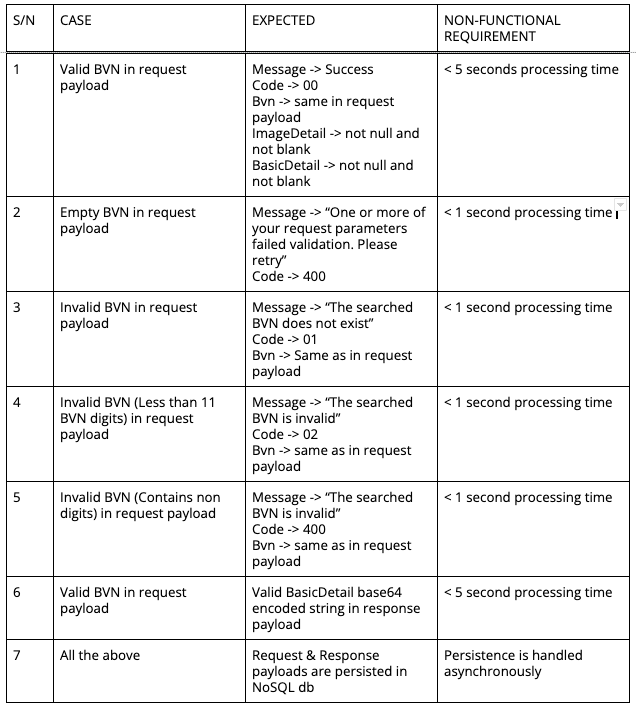
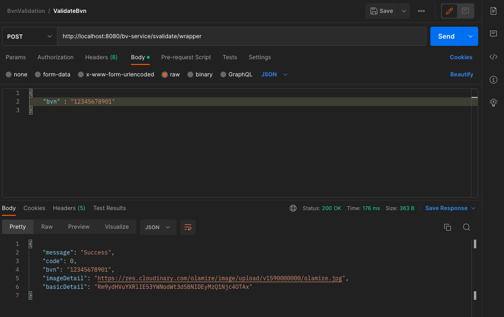
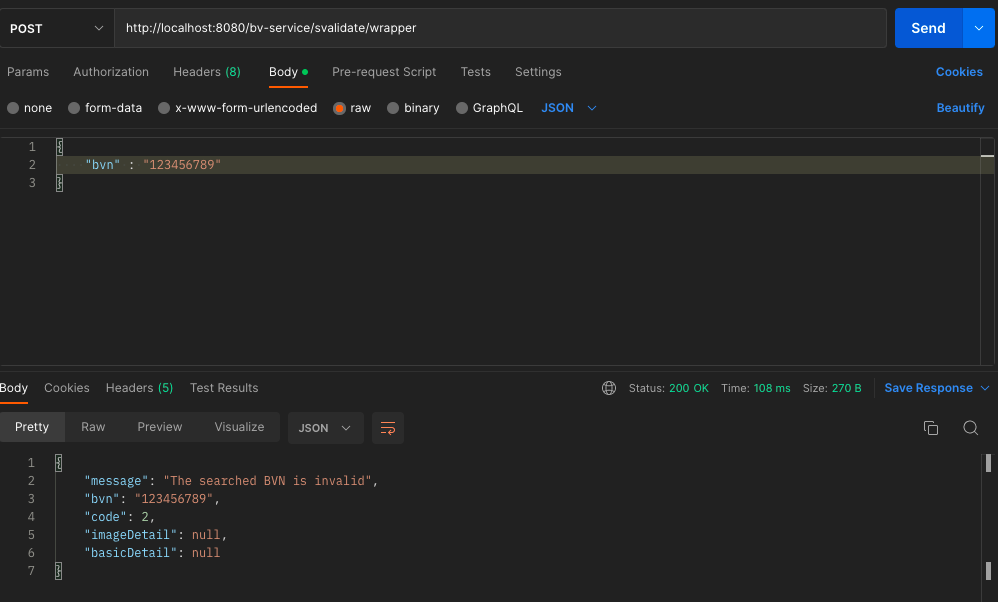
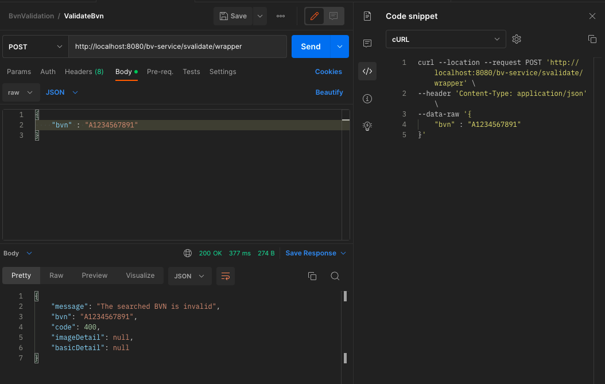
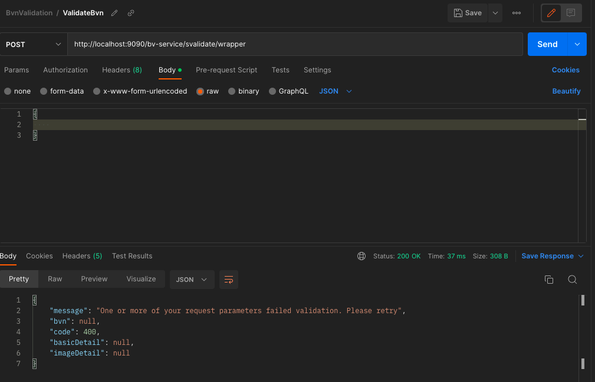
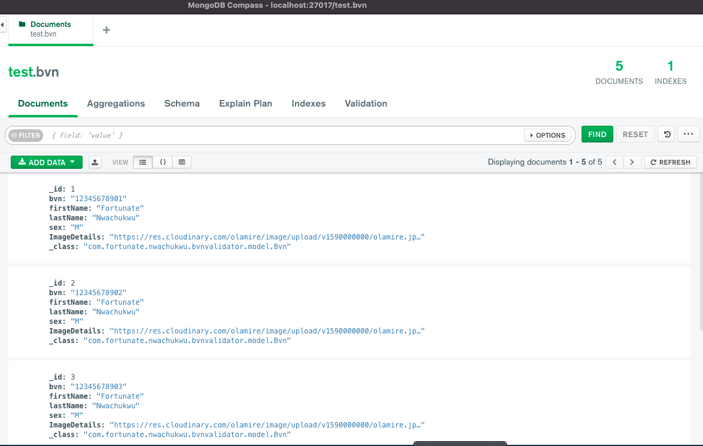

# BVN VALIDATION

This is a service to validate BVNs, preconfigured in memory.

## PREREQUISITES

1. MongoDb must be running locally
2. Request and response objects are stored in a MongoDb NoSql store,
   based on the configured properties.

### Technologies

- Java
- Maven
- Springboot
- JUnit
- MongoDB

### Requirements

You need the following to build and run the application:

- [JDK 17](https://www.oracle.com/java/technologies/javase-jdk17-downloads.html)
- [Maven 3.8.1](https://maven.apache.org) (Optional as code already contains maven wrapper)

## How to run

### step 1 - clone project with from [here](https://github.com/NfoTECH/Seamfix_Assessment.git)

```
git clone https://github.com/NfoTECH/Seamfix_Assessment.git
```

### step 2 - move into the project directory

```
cd seamfix_assessment/
```

### step 3 - Generate the .jar file

```
mvn clean install
OR
./mvnw clean install
```

### step 4 - run the project

```
java -jar seamfix_assessment-0.0.1-SNAPSHOT.jar
```

### NOTE :

- The application can also be run as a standalone application, by running as a springboot project with the "play" but on IntelliJ
---
### Testing the API endpoint with various bvn inputs
---

- BVN 12345678901

### Test Cases to Consider

## 

#### Endpoint

```
http://localhost:8080/bv-service/svalidate/wrapper
```

#### 1. Valid BVN

```
curl --location --request POST 'http://localhost:8080/bv-service/svalidate/wrapper' \
--header 'Content-Type: application/json' \
--data-raw '{
    "bvn" : "12345678901"
}'
```

#### Response

```json
{
    "message": "Success",
    "code": 0,
    "bvn": "12345678901",
    "imageDetail": "https://res.cloudinary.com/olamire/image/upload/v1590000000/olamire.jpg",
    "basicDetail": "Rm9ydHVuYXRlIE53YWNodWt3dSBNIDEyMzQ1Njc4OTAx"
}
```

## 

#### 2. Invalid BVN

```
curl --location --request POST 'http://localhost:8080/bv-service/svalidate/wrapper' \
--header 'Content-Type: application/json' \
--data-raw '{
    "bvn" : "123456789011"
}'
```
#### Response

```json
{
    "message": " “The searched BVN does not exist",
    "bvn": "123456789011",
    "code": 1,
    "imageDetail": null,
    "basicDetail": null
}
```
## 

#### 3. BVN with invalid length

```
curl --location --request POST 'http://localhost:8080/bv-service/svalidate/wrapper' \
--header 'Content-Type: application/json' \
--data-raw '{
    "bvn" : "123456789"
}'
```
#### Response

```json
{
    "message": " “The searched BVN is invalid",
    "bvn": "123456789",
    "code": 1,
    "imageDetail": null,
    "basicDetail": null
}
```

## 

#### 4. BVN with invalid characters

```
curl --location --request POST 'http://localhost:8080/bv-service/svalidate/wrapper' \
--header 'Content-Type: application/json' \
--data-raw '{
    "bvn" : "A1234567891"
}'
```
#### Response

```json
{
   "message": "The searched BVN is invalid",
   "bvn": "A1234567891",
   "code": 400,
   "imageDetail": null,
   "basicDetail": null
}
```

## 

#### 5. Empty BVN

```
curl --location --request POST 'http://localhost:8080/bv-service/svalidate/wrapper' \
--header 'Content-Type: application/json' \
--data-raw '{
    
}'
```
#### Response

```json
{
   "message": "One or more of your request parameters failed validation. Please retry",
   "bvn": null,
   "code": 400,
   "imageDetail": null,
   "basicDetail": null
}
```

## 

#### 6. MongoDB test data

## 